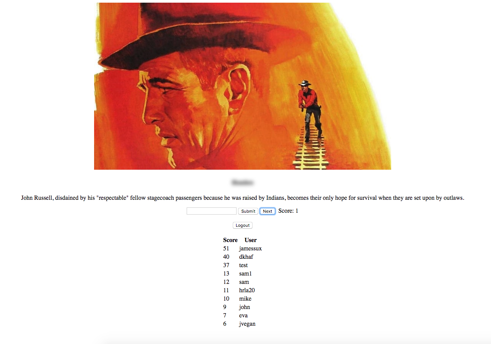

# Guess that Movie
Guess that Movie is an entertainment app that lets users compete in a game of guessing movie titles based off of limited info.

## Getting Started

Once you've configured everything properly as per the Prerequisites section, run the following:

1. `yarn` (install dependencies)
2. `yarn react-dev` (compile client)
3. `yarn server-dev` (start REST server)

### Prerequisites

**MongoDB** Have an instance running on your machine, port `27017`.

**The Movie Database (TMDb) API Key** This can be obtained from their website: https://www.themoviedb.org/. It should be placed in: `config/index.js`.

## Built With

* [Node.js](https://nodejs.org/en/)
* [React](https://reactjs.org/)
* [Webpack](https://webpack.js.org/)
* [Express](https://expressjs.com/)
* [MongoDB](https://www.mongodb.com/)
* [Mongoose](http://mongoosejs.com/)

## Contributing

We're currently not accepting contributions at this time. Perhaps some day in the future.

## Authors

* **James Yen** – [GitHub](https://github.com/jameshyen)

## Acknowledgments

* Hack Reactor, Los Angeles
